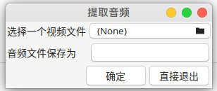
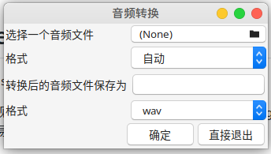

[English](./README_en.md)

# MediaConverter

一个Linux下的音频提取、格式转换、图像格式处理GUI应用。

工作中经常遇到需要将音频、视频、图片进行转码等需求，ffmpeg、image magick等命令行应用可以完成这些工作，但是命令行不太容易记，用过一次很久不用的话后面就容易忘记。

现在通过yad和脚本提供一个简单的GUI界面，目的是方便操作。

# 界面截图

# 功能

- [x] 从视频文件中提取音频(使用ffmpg)，支持的格式
  - [x] pcm(signed, little endian, 16bits)
  - [x] mp3
  - [x] wav
  - [x] opus

- [x] 音频格式间互相转换
  - [x] pcm(signed, little endian, 16bits)
  - [x] mp3
  - [x] wav
  - [x] opus
  
- [ ] 视频格式间互间转换

- [ ] 图像格式间互相转换
  - [ ] png to rgba
  - [ ] png to rgb
  - [ ] everything to png
  - [ ] everything to jpeg
  
- [ ] 视频提取图像
  - [ ] 提取所有I帧为png
  - [ ] 提取所有I帧为rgba
  
- [ ] 图像转视频
  - [ ] 播放图像序列 png
  - [ ] 播放图像序列 rgba
  - [ ] 播放图像序列 yuv
  - [ ] 图像序列转视频 png
  - [ ] 图像序列转视频 rgba
  - [ ] 图像序列转视频 yuv

# 贡献代码

大家随意贡献代码，功能增强、代码质量改进、bug修复等我都愿意合入。
现有代码只是一个media-converter.sh脚本文件，需要通过yad显示一个图像界面，通过ffmpeg实现具体功能，错误检查之类的也没有做。

# 持续集成

每次推送代码都会执行一次构建，构建结果是一个deb包，点Actions可以看到。
