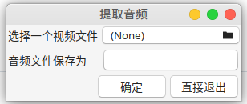

# MediaConverter

A linux GUI App for extracting audio track from video, and a format converter for video, audio and images.

ffmpeg and image magick can be used to accomplish tasks such as converting images/videos/audios between different formats. 
However, command line interface is hard to use and people tend to forget not frequently used commands.

This project provide a simple GUI interface for accomplish the above mentioned tasks. This project is provide merely a script,
which uses yad to present the user a GUI and using ffmpeg and image magick to do the real conversion.

# Snapshots

# Features

- [x] extract audio from a video clip, supported formats:
  - [x] pcm(signed, little endian, 16bits)
  - [x] mp3
  - [x] wav
  - [x] opus

- [x] audio conversion
  - [x] pcm(signed, little endian, 16bits)
  - [x] mp3
  - [x] wav
  - [x] opus
  
- [ ] video conversion

- [ ] image conversion
  - [ ] png to rgba
  - [ ] png to rgb
  - [ ] everything to png
  - [ ] everything to jpeg
  
- [ ] extract images from video
  - [ ] extract I-frames as png images
  - [ ] extract I-frames as rgba images
  
- [ ] convert image sequence to video
  - [ ] play png image sequence
  - [ ] play rgba image sequence
  - [ ] play yuv image sequence
  - [ ] convert png image sequence to video
  - [ ] convert rgba image sequence to video
  - [ ] convert yuv image sequence to video

# Contribute

Current code includes only a media-converter.sh script and some .desktop file and icon files.

Any contribution including new features, better code or bug fixes is welcome.

# CI

We have CI enabled. Every time you push code to this repo, a deb package is built. Just find it out at [Actions](https://github.com/zhangfuwen/MediaConverter/actions) .
